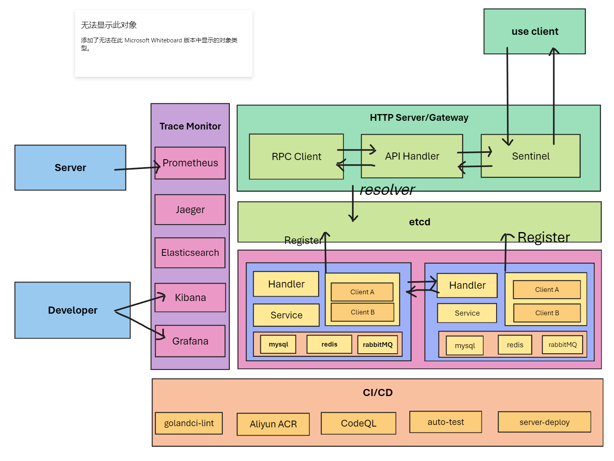

#### DouServer
This is a simple short video service backend based on HTTP and RPC protocols, distributed architecture

#### Technology stack
 - Kitex
 - Hertz
 - etcd
 - MySQL
 - Redis
 - Jaeger
 - Prometheus
 - Grafana
 - Elasticsearch
 - Kibana

#### 特性
 - Extremely easy to get started with and deploy
 - Relatively high code quality
 - Security considerations
 - Performance optimization for interfaces

#### Architecture


#### Project Structure

##### whole
```
.

├── cmd                   # Microservices
├── config                # allocation
├── docs
├── go.mod
├── go.sum
├── kitex_gen
├── pkg
│   ├── constants         # Store some constants
│   ├── errno             # Customization error
│   ├── middleware        # Common middleware
│   ├── tracer            # Link tracking
│   └── utils             # Useful features
└── test
```

##### Gateway/API module
```
.
├── Makefile
├── biz
│   ├── handler     # Request processing, packaging, and returning data
│   ├── middleware
│   ├── model
│   ├── pack        # pack
│   ├── router      # route
│   └── rpc         # Send RPC request
├── build.sh
├── main.go
├── output          # Binary files
├── router.go
├── router_gen.go
└── script
```

##### Microservices
```
.
├── Makefile        # Useful commands
├── build.sh        # Building scripts
├── dal
│   ├── cache       # redis
│   ├── db          # MySQL
│   └── mq          # RabbitMQ
├── handler.go
├── kitex_info.yaml
├── main.go
├── output          # Built binary files
├── pack            # Pack and return data
├── rpc             # Send requests to other RPC services
├── script
├── coverage        # Coverage test results (some not available)
└── service
```
